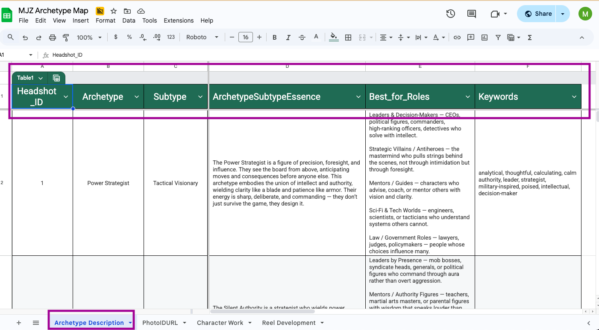

# AI Actor Headshot Submission Agent

Increase actor's casting call backs by picking the right headshot for the right role.  
This workflow is built in **n8n** and automates the process of parsing a casting role description, mapping it to a curated Google Sheets headshot database, and returning the **Top 3 best-fit headshots** for submission.

---

## ✨ Features
- **Role parsing** → Converts casting breakdown text into structured attributes.  
- **Archetype mapping** → Matches against a curated actor headshot map in Google Sheets.  
- **Weighted scoring** → Ranks by Essence (45%), Roles (20%), Keywords (20%), Archetype (10%), Subtype (5%).  
- **Top 3 output** → Returns the 3 most suitable looks with their IDs.  

---

## 🚀 How to Use

1. Open [n8n](https://n8n.io).  
2. In the workflow editor, click the **three-dot menu (⋮)** → **Import from File**.  
3. Upload the file: `AI-Archetype-Identifier.json` from this repo.  
4. Add your API keys (OpenAI, Google Sheets, etc.) inside n8n’s **Credentials** section.  
5. Click **Execute Workflow** to run the agent and see your top 3 headshot matches.

## 🖼 Workflow Overview

### Setting up Google Sheets for workflow’s Build Catalog node

👉 Required headers (exactly):
Headshot_ID – a unique ID per headshot (e.g., MJ-049)
Archetype – short label (e.g., Velvet Enforcer)
Subtype – short label (e.g., The Iron Sentinel)
ArchetypeSubtypeEssence – text blob of key phrases (comma/semicolon separated)
Best_for_Roles – text blob of role phrases (comma/semicolon separated)
Keywords – text blob of keywords (comma/semicolon separated)

### 🖼 Google Sheets Archetype Setup

👉 Tab 1

📊 Formatting the Google Categories: "Essence" / "Roles" / "Keywords"

Enter short phrases (2–3 words, nouns/adjectives) separated by commas or semicolons in a single cell.
Each row represents one headshot/look.
The parser converts these fields into arrays and scores them against role descriptions.

Example: 
Headshot_ID: 49
Archetype: Velvet Enforcer
Subtype: The Iron Sentinel
ArchetypeSubtypeEssence: quiet command; stoic restraint; watchful; dignified protector
Best_for_Roles: law enforcement; military strategist; disciplinarian teacher; community protector
Keywords: stoic; watchful; protector; authority; unyielding; boundaries; command; composed

Where these fields are used
The parser creates:
archetype (string), subtype (string), archetype_subtype_essence (array), best_for_roles (array), keywords (array). 

Screenshot:

Parser output:
archetype → string
subtype → string
archetype_subtype_essence → array
best_for_roles → array
keywords → array

Scoring weights (Top 3 Headshots node):
Essence → 0.45
Best for Roles → 0.20
Keywords → 0.20
Archetype → 0.10
Subtype → 0.05

Tips:
First row must be headers; avoid blank rows.
Keep Headshot_ID unique (it’s the identifier returned in results).
If the sheet is renamed or moved, update the Read Archetype Map node (Document ID + Sheet).
Optional columns (e.g., Expression, Energy, Presence, Notes) can be added for reference — they won’t affect scoring unless explicitly mapped.
This makes the section skimmable, structured, and recruiter-friendly.

👉 Tab 2
To keep the data structure clean and modular, the headshot map is split into two tabs. The first tab contains the core archetype data (ID, archetype, subtype, essence, roles, keywords, etc.), while the second tab holds only the PhotoURL values mapped by Headshot_ID. This separation ensures the workflow can process textual attributes for scoring without being slowed down by large image links or formatting issues. This design also makes the sheet easier to maintain: role descriptors and archetype notes can evolve independently from image hosting or link updates, reducing errors and keeping the dataset scalable as new headshots are added.

Once Headshot_ID is identified, manually click on the second tab of the Google Sheet to identify the correlating headshot photo.

Optional: If you do not want to manually look up the photoURL ID directly on Google Sheets, you can build two extra nodes on the n8n workflow so that the final output gives you the HeadshotURL as well as the Headshot_ID. Here's how: Create a separate node that reads the second tab of Google Sheets. Title the node "Read PhotoURL." Then, create a merge node that combines "Read Archetype Map" with "Read PhotoURL." Then connect it to the "Build Catalog" node. This way, the agent simply joins the two tabs on Headshot_ID to fetch the correct photo URL. 

Screenshot of Tab 2:

##### Conclusion
In conclusion, the AI Archetype Submission Agent is designed to give actors, agents, and managers a competitive edge by aligning the right headshot with the right role. By breaking down both casting descriptions and headshots into archetypes—and further parsing them through keywords, essence, and role types—the workflow makes nuanced comparisons that go beyond surface-level matching. Its weighted scoring system prioritizes essence, followed by “best for roles” and keywords, with archetype and subtype providing additional context. This ensures that the headshots selected most closely reflect the emotional and narrative qualities of the role. Once integrated into the casting workflow, this system enhances the precision of submissions, ultimately increasing the likelihood of callbacks.

